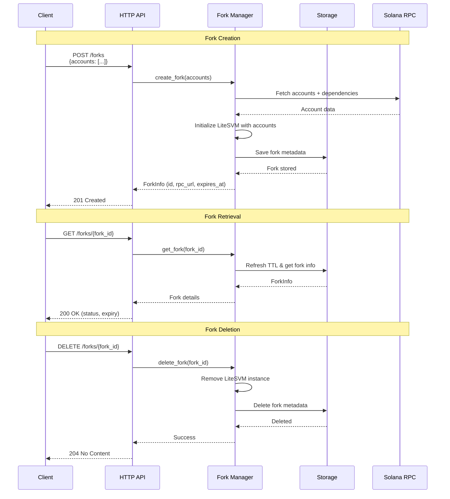
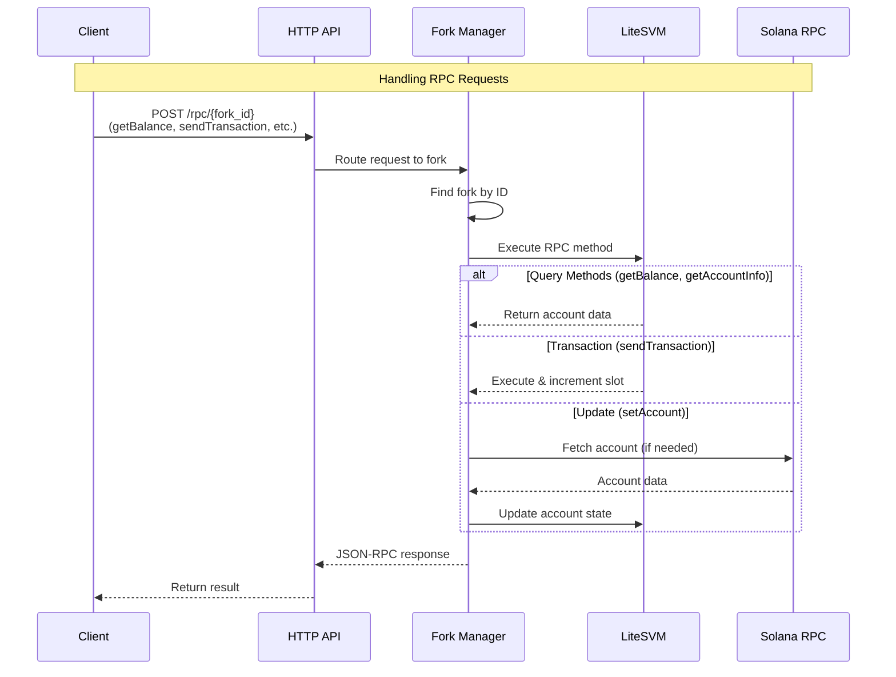

# sol-sim - Solana Fork Simulation Engine

A Solana blockchain forking and simulation engine built in Rust. Creates isolated, in-memory forks of Solana mainnet state for testing, development, and transaction simulation.

## Key Features

- **Fork Creation**: Fork any solana network (mainnet, testnet, devnet) state with specific accounts in seconds
- **Isolated Execution**: Each fork is completely isolated with its own state
- **Transaction Simulation**: Execute transactions and view results without affecting mainnet
- **Account State Management**: Query and modify account states on forked chains
- **JSON-RPC Compatible**: Standard Solana RPC methods supported (supported methods: `getBalance`, `getAccountInfo`, `sendTransaction`, `setAccount`, `getLatestBlockhash`)
- **Automatic Dependency Resolution**: Recursively fetches program dependencies and BPF upgradeable program data
- **Docker Deployment**: Production-ready containerized deployment

## Architecture

### System Components

```
┌─────────────────────────────────────────────────────────────┐
│                       sol-sim Service                       │
│                                                             │
│  ┌──────────────┐  ┌──────────────┐  ┌──────────────┐       │
│  │   HTTP API   │  │ Fork Manager │  │   Storage    │       │
│  │   (Axum)     │──│  (liteSVM)   │──│  (In-Memory) │       │
│  └──────────────┘  └──────────────┘  └──────────────┘       │
│                           │                                 │
│                    ┌──────┴────────┐                        │
│                    │               │                        │
│              ┌─────▼─────┐   ┌────▼────┐                    │
│              │  Fork #1  │   │ Fork #2 │  ...               │
│              └───────────┘   └─────────┘                    │
│                                                             │
└─────────────────────────────────────────────────────────────┘
                          │
                          ▼
            ┌─────────────────────────┐
            │   Solana Mainnet RPC    │
            │  (Account Data Source)  │
            └─────────────────────────┘
```


### Data Flow

#### Fork Lifecycle Operations



#### RPC Request Flow




### Core Modules

1. **main.rs** - Application Entry Point
<!-- - Initializes tracing/logging subsystem
- Sets up Axum HTTP server with CORS and request tracing
- Configures routes and middleware
- CLI argument parsing for port and RPC endpoint configuration -->
2. **api.rs** - HTTP API Layer
<!-- - RESTful endpoints for fork lifecycle management
- JSON-RPC request routing and error handling
- Request/response serialization and validation
- Health check endpoint -->
3. **fork.rs** - Fork Management Core
<!-- - `ForkManager`: Orchestrates all fork operations
- Account fetching with recursive dependency resolution
- LiteSVM instance lifecycle management
- Transaction execution and slot progression
- RPC method implementations (`getBalance`, `getAccountInfo`, `sendTransaction`, `setAccount`, `getLatestBlockhash`)
- Chain context initialization (slot synchronization) -->
4. **storage.rs** - Fork Metadata Storage
<!-- - In-memory fork metadata store using `HashMap`
- TTL management (15-minute expiration with automatic refresh)
- Thread-safe operations using `RwLock`
- Fork info persistence and retrieval -->
5. **types.rs** - Type Definitions
<!-- - `ForkId`: UUID-based fork identifier
- `ForkInfo`: Fork metadata with expiration tracking
- `AccountData`: Serializable account state representation
- JSON-RPC request/response structures
- API request/response DTOs -->

## Setup

### Prerequisites

- **Rust**: 1.75+ (nightly for LiteSVM)
- **Docker**: 20.10+ (for containerized deployment)
- **Docker Compose**: 1.29+ (optional, for orchestration)

### Local Development

#### 1. Clone and Build

```bash
git clone <repository-url>
cd sol-sim/sol-sim
cargo build --release
```

#### 2. Run the Service

```bash
# Using cargo directly
cargo run -- --port 8080 --solana-rpc https://api.mainnet-beta.solana.com

# Or using the binary
./target/release/sol-sim --port 8080 --solana-rpc https://api.mainnet-beta.solana.com

# Or using the bash script
./scripts/start.sh

# With debug logging
RUST_LOG=debug cargo run
```

#### 3. Verify Health

```bash
curl http://localhost:8080/health
```

**Expected Response:**
```json
{
  "success": true,
  "status": "healthy",
  "version": "0.1.0",
  "uptime": "5m 23s",
  "timestamp": "2025-11-05T10:30:00Z"
}
```

### Docker Deployment

#### Using Docker Compose

```bash
# Start service
docker-compose up -d

# View logs
docker-compose logs -f

# Stop service
docker-compose down
```

To test out the service, you can use the following script:
```bash
./scripts/demo.sh
```
This will create a fork with the USDC mint account and then query the fork status, delete the fork, and verify the deletion.


<details>
<summary><h2>API Reference</h2></summary>

### Fork Management

#### Create Fork
```http
POST /forks
Content-Type: application/json

{
  "accounts": [
    "11111111111111111111111111111111",
    "JUP6LkbZbjS1jKKwapdHNy74zcZ3tLUZoi5QNyVTaV4"
  ]
}
```

**Response (201 Created):**
```json
{
  "success": true,
  "forkId": "c6193d87-8e44-4a09-bb61-848dc54dc1dc",
  "rpcUrl": "http://localhost:8080/rpc/c6193d87-8e44-4a09-bb61-848dc54dc1dc",
  "createdAt": "2024-11-04T15:15:00Z",
  "expiresAt": "2024-11-04T15:30:00Z",
  "accountCount": 2,
  "ttlMinutes": 15
}
```

#### Get Fork Info
```http
GET /forks/{fork_id}
```

**Response (200 OK):**
```json
{
  "success": true,
  "forkId": "c6193d87-8e44-4a09-bb61-848dc54dc1dc",
  "rpcUrl": "http://localhost:8080/rpc/c6193d87-8e44-4a09-bb61-848dc54dc1dc",
  "status": "active",
  "createdAt": "2024-11-04T15:15:00Z",
  "expiresAt": "2024-11-04T15:30:00Z",
  "remainingMinutes": 12,
  "accountCount": 2
}
```

#### Delete Fork
```http
DELETE /forks/{fork_id}
```

**Response (200 OK):**
```json
{
  "success": true,
  "message": "Fork successfully deleted",
  "forkId": "c6193d87-8e44-4a09-bb61-848dc54dc1dc"
}
```

#### Error Response Format

All endpoints return errors in a consistent format:

```json
{
  "success": false,
  "error": {
    "code": "ERROR_CODE",
    "message": "Human-readable error message",
    "details": "Optional detailed error information"
  }
}
```

**Error Codes:**
- `INVALID_FORK_ID` - The fork ID format is invalid
- `FORK_NOT_FOUND` - The fork does not exist or was deleted
- `FORK_CREATION_FAILED` - Failed to create fork
- `DELETE_FAILED` - Failed to delete fork
- `INTERNAL_ERROR` - Internal server error

### JSON-RPC Methods

All RPC calls are made to the fork-specific endpoint: `POST /rpc/{fork_id}`

#### getBalance
```json
{
  "jsonrpc": "2.0",
  "id": 1,
  "method": "getBalance",
  "params": ["9WzDXwBbmkg8ZTbNMqUxvQRAyrZzDsGYdLVL9zYtAWWM"]
}
```

#### getAccountInfo
```json
{
  "jsonrpc": "2.0",
  "id": 1,
  "method": "getAccountInfo",
  "params": [
    "JUP6LkbZbjS1jKKwapdHNy74zcZ3tLUZoi5QNyVTaV4",
    {"encoding": "base64"}
  ]
}
```

#### sendTransaction
```json
{
  "jsonrpc": "2.0",
  "id": 1,
  "method": "sendTransaction",
  "params": ["<base64-encoded-transaction>"]
}
```

#### setAccount (Custom Method)
```json
{
  "jsonrpc": "2.0",
  "id": 1,
  "method": "setAccount",
  "params": [
    "9WzDXwBbmkg8ZTbNMqUxvQRAyrZzDsGYdLVL9zYtAWWM",
    {
      "lamports": 5000000000,
      "data": "",
      "owner": "11111111111111111111111111111111",
      "executable": false
    }
  ]
}
```

Or fetch from mainnet:
```json
{
  "jsonrpc": "2.0",
  "id": 1,
  "method": "setAccount",
  "params": ["9WzDXwBbmkg8ZTbNMqUxvQRAyrZzDsGYdLVL9zYtAWWM"]
}
```

#### getLatestBlockhash
```json
{
  "jsonrpc": "2.0",
  "id": 1,
  "method": "getLatestBlockhash",
  "params": []
}
```
</details>

## Test Suite


### Running Tests

```bash
# Run all tests
cargo test

# Run specific test file
cargo test --test integration_tests
cargo test --test fork_tests

# Run specific test
cargo test test_jupiter_lend_wsol_deposit

# Run with output
cargo test -- --nocapture

# Run with specific log level
RUST_LOG=debug cargo test -- --nocapture
```

### Test Requirements

- **Service Running**: Integration tests require the service to be running on `localhost:8080`
- **Network Access**: Tests fetch real account data from mainnet
- **Mainnet RPC**: Service must be configured with valid Solana mainnet RPC

The test suite comprises two main test files with comprehensive coverage of core functionality:

### integration_tests.rs - API Integration Tests

**Test Count:** 7 tests  
**Focus:** End-to-end API functionality through HTTP layer

#### Test Coverage

1. **test_fork_lifecycle** - Basic fork CRUD operations
2. **test_account_operations** - Account state management
3. **test_transaction_execution** - Transaction processing
4. **test_slot_progression** - Chain state advancement
5. **test_concurrent_transactions** - Sequential transaction handling
6. **test_error_handling** - Error scenarios

### fork_tests.rs - Advanced Fork Scenarios

**Test Count:** 5 tests  
**Focus:** Complex real-world DeFi scenarios and stress testing

#### Test Coverage

1. **test_fork_simple_sol_transfer** - Basic SOL transfer
2. **test_fork_complex_transaction** - Multi-instruction transactions
3. **test_fork_multiple_protocols** - DeFi protocol loading
4. **test_fork_sequential_transactions_stress** - Load testing
5. **test_jupiter_lend_wsol_deposit** - Real transaction replay


<!-- 
### Test Execution Strategy

Tests use a `TestContext` helper struct that provides:
- HTTP client for API calls
- Fork creation/deletion helpers
- RPC call wrappers
- Transaction signing and sending utilities
- Balance and account info query methods

Each test follows the pattern:
1. Create fork with required accounts
2. Execute test operations
3. Validate results
4. Clean up fork

## Technical Implementation Details

### Concurrency Model

- **Async Runtime:** Tokio with full features enabled
- **Fork Isolation:** Each fork has independent `Arc<Mutex<LiteSVM>>` instance
- **Metadata Access:** `RwLock` for fork metadata allowing concurrent reads
- **Transaction Serialization:** Mutex ensures transactions execute sequentially per fork

### Memory Management

- **Fork Storage:** In-memory `HashMap` with automatic TTL-based expiration
- **Account Data:** Serialized accounts stored in LiteSVM instances
- **TTL Refresh:** Activity-based extension (15 minutes from last interaction)
- **Cleanup:** Manual deletion via API or automatic expiration

### State Management

- **Slot Tracking:** Clock sysvar maintained per fork, incremented post-transaction
- **Blockhash:** Generated by LiteSVM, consistent within fork lifetime
- **Account Versioning:** No versioning; state is mutable and cumulative

### Error Handling

- **Graceful Degradation:** Network errors during account fetch reported but don't crash service
- **Transaction Failures:** Returned as JSON-RPC error responses with detailed messages
- **Fork Not Found:** Returns 404 for invalid/expired fork IDs
- **Invalid Requests:** Returns 400 with descriptive error messages

### Performance Characteristics

- **Fork Creation:** 1-5 seconds (depends on account count and complexity)
- **Transaction Execution:** ~10-50ms per transaction
- **Concurrent Forks:** Limited only by available memory
- **Account Fetch:** Batched via `getMultipleAccounts` (max 100 accounts per batch)

## Dependencies

### Core Dependencies

- **tokio** (1.0): Async runtime with full features
- **axum** (0.8.6): Modern web framework with JSON and macros
- **litesvm** (0.8.1): Lightweight Solana VM for transaction simulation
- **solana-sdk** (3.0.0): Solana core types and cryptography
- **solana-client** (3.0.8): Solana RPC client for mainnet interaction
- **serde** (1.0) / **serde_json** (1.0): Serialization framework
- **uuid** (1.0): Fork ID generation with v4 UUIDs
- **anyhow** (1.0): Error handling and propagation
- **chrono** (0.4): Date/time handling for expiration
- **base64** (0.22.1): Account data encoding/decoding
- **reqwest** (0.11): HTTP client for mainnet RPC calls

### Additional Dependencies

- **tower** (0.5.2) / **tower-http** (0.6.6): Middleware (CORS, tracing)
- **tracing** (0.1.41) / **tracing-subscriber** (0.3): Structured logging
- **clap** (4.0): CLI argument parsing
- **bincode** (1.3): Transaction serialization

## Environment Variables

- `RUST_LOG`: Log level configuration (e.g., `info`, `debug`, `sol_sim=debug`)
- `PORT`: Override default port (8080)
- `SOLANA_RPC`: Override Solana RPC endpoint

## Limitations and Considerations

### Current Limitations

1. **No Persistence:** All forks are in-memory; service restart clears all state
2. **Single-Instance:** No distributed deployment support
3. **RPC Method Coverage:** Limited subset of Solana RPC methods implemented
4. **Account Limits:** Large account sets (>100 accounts) may have slower fork creation
5. **Address Lookup Tables:** Limited support for transactions using ALTs
6. **No Block History:** Only current slot available; no historical queries

### Production Considerations

1. **Memory Scaling:** Monitor memory usage with many concurrent forks
2. **RPC Rate Limits:** Mainnet RPC may rate-limit during account fetching
3. **TTL Management:** Implement fork cleanup job for expired forks
4. **Authentication:** Add auth layer for production deployments
5. **Metrics:** Integrate Prometheus or similar for observability
6. **Logging:** Configure structured logging for production troubleshooting

## Future Enhancements

- [ ] Persistent fork storage (Redis/PostgreSQL)
- [ ] WebSocket support for real-time updates
- [ ] Additional RPC methods (getTransaction, getBlock, etc.)
- [ ] Fork snapshotting and restoration
- [ ] Transaction history and replay
- [ ] Address lookup table full support
- [ ] Multi-node deployment with shared state
- [ ] GraphQL API layer
- [ ] Built-in rate limiting
- [ ] Authentication and authorization -->
